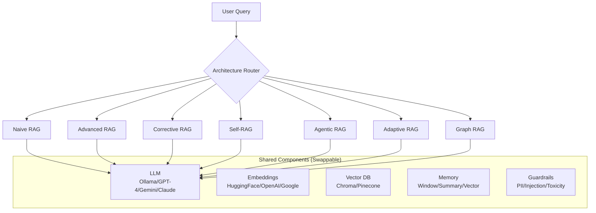
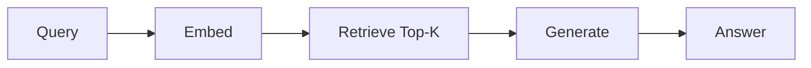
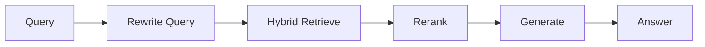
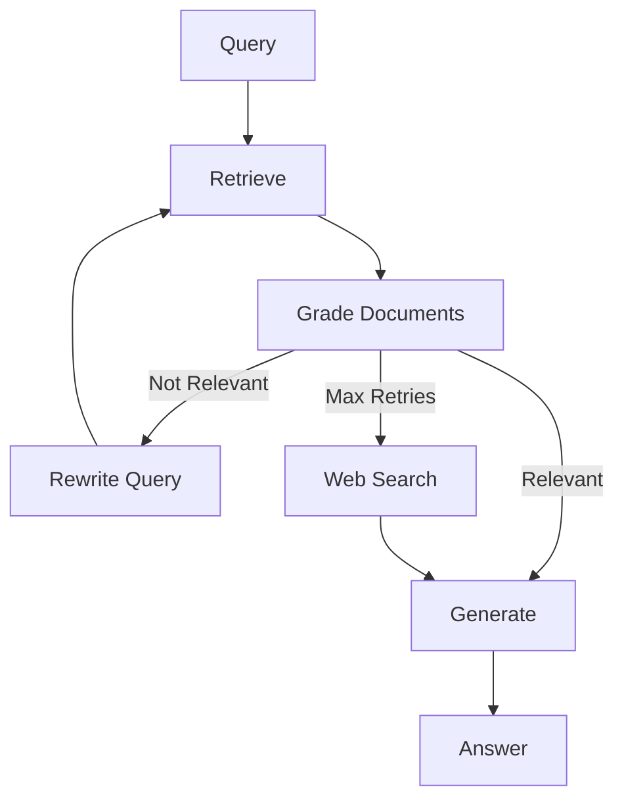
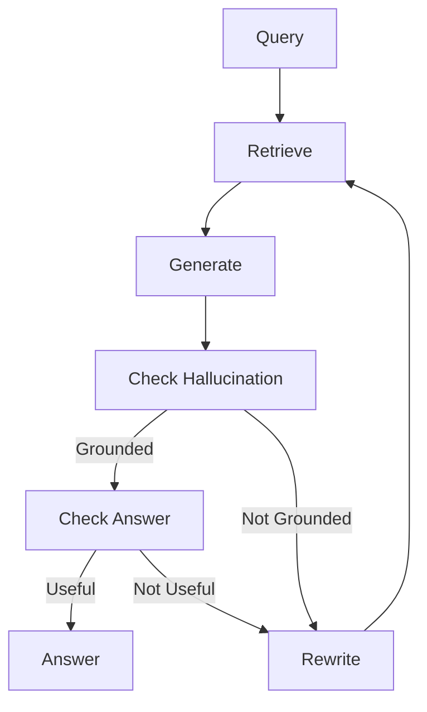
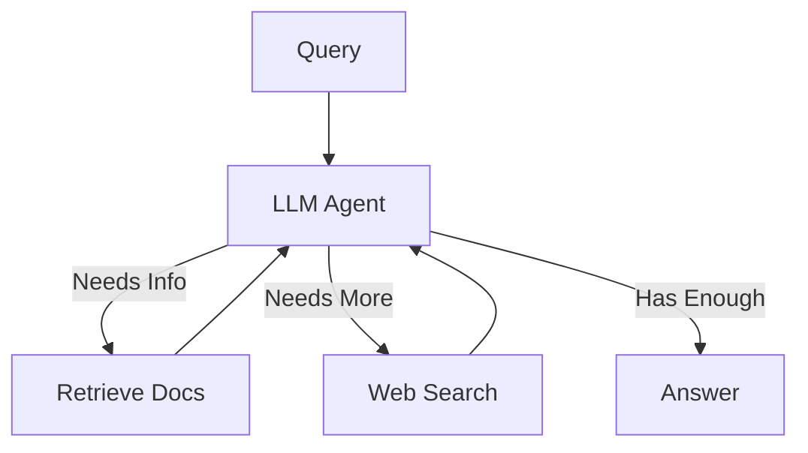
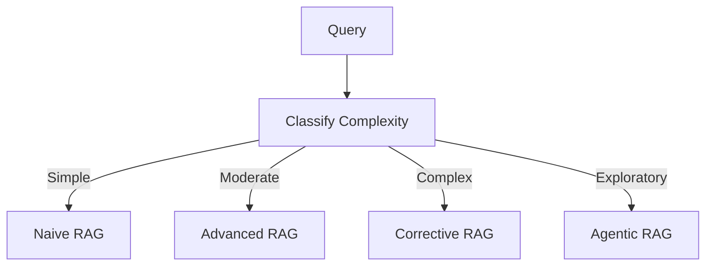
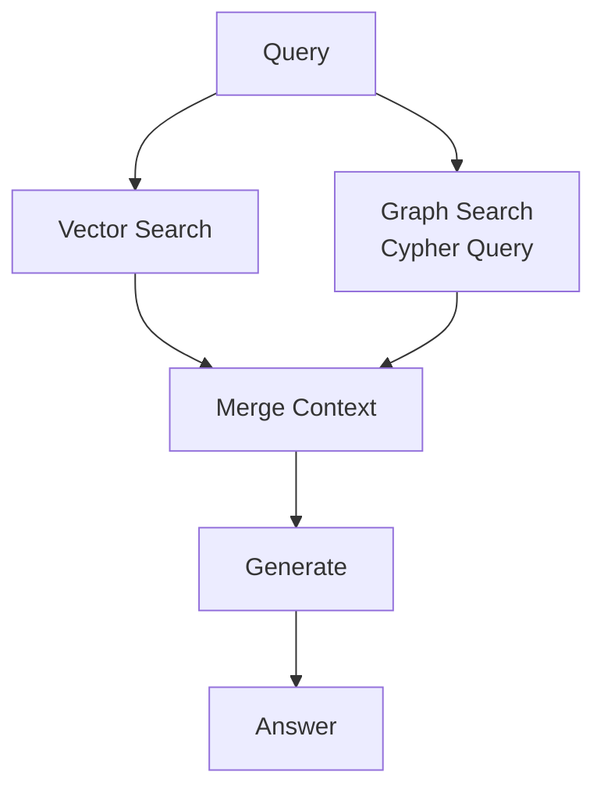

# ModularRAG

**A multi-architecture RAG platform** designed for flexibility and ease of integration. Choose from 7 RAG architecture types, each with fully swappable components - from the LLM to the vector database to memory management - configurable via simple YAML files. No code changes required.

> **Design Decision - Framework Choice**: LangChain is the primary orchestration framework. LlamaIndex is supported as an optional retriever backend (install with `uv pip install 'modular-rag[llamaindex]'`). This avoids dual-framework dependency issues while allowing users who prefer LlamaIndex's data connectors to plug them in. LangGraph powers the advanced graph-based architectures (Corrective, Self-RAG, Agentic, Adaptive).

---

## 🏗️ Architecture Types

ModularRAG supports **7 RAG architectures**, each suited for different use cases:

| Architecture | Description | Best For | Documentation |
|---|---|---|---|
| **Naive RAG** | Simple retrieve → generate | POCs, demos, simple Q&A | [Docs](docs/architectures/naive-rag.md) |
| **Advanced RAG** | Query rewriting + hybrid search + reranking | Production systems | [Docs](docs/architectures/advanced-rag.md) |
| **Corrective RAG** | Grades docs, rewrites or falls back to web search | High-accuracy requirements | [Docs](docs/architectures/corrective-rag.md) |
| **Self-RAG** | Self-reflective generation with hallucination checks | Critical applications | [Docs](docs/architectures/self-rag.md) |
| **Agentic RAG** | LLM agent with tools for iterative reasoning | Multi-hop questions | [Docs](docs/architectures/agentic-rag.md) |
| **Adaptive RAG** | Auto-routes queries to the best architecture | Cost/performance optimization | [Docs](docs/architectures/adaptive-rag.md) |
| **Graph RAG** | Knowledge graph + vector hybrid retrieval | Relationship-heavy data | [Docs](docs/architectures/graph-rag.md) |


```mermaid
graph TD
    User[User Query] --> Router{Architecture Router}
    
    Router --> Naive[Naive RAG]
    Router --> Advanced[Advanced RAG]
    Router --> CRAG[Corrective RAG]
    Router --> SelfRAG[Self-RAG]
    Router --> Agentic[Agentic RAG]
    Router --> Adaptive[Adaptive RAG]
    Router --> GraphRAG[Graph RAG]

    subgraph "Shared Components (Swappable)"
        LLM[LLM<br/>Ollama/GPT-4/Gemini/Claude]
        Embed[Embeddings<br/>HuggingFace/OpenAI/Google]
        VDB[Vector DB<br/>Chroma/Pinecone]
        Mem[Memory<br/>Window/Summary/Vector]
        Guard[Guardrails<br/>PII/Injection/Toxicity]
    end

    Naive --> LLM
    Advanced --> LLM
    CRAG --> LLM
    SelfRAG --> LLM
    Agentic --> LLM
    Adaptive --> LLM
    GraphRAG --> LLM
```

---

## 🚀 Getting Started

### Prerequisites
- Python 3.12+
- `uv` package manager
- **(Optional)** Ollama for local LLMs: [ollama.ai](https://ollama.ai)
- **(Optional)** API keys for cloud providers (OpenAI, Google, Anthropic)

### Step 1: Installation
```bash
# Clone the repository
git clone https://github.com/vk2git/ModularRAG.git
cd ModularRAG

# Install core dependencies
uv sync

# Optional: install extras for specific features
uv pip install 'modular-rag[rerank]'     # Cross-encoder reranking
uv pip install 'modular-rag[search]'     # Web search fallback
uv pip install 'modular-rag[graph]'      # Graph RAG (Neo4j)
uv pip install 'modular-rag[monitoring]' # LangSmith tracing
uv pip install 'modular-rag[all]'        # Everything
```

### Step 2: Configuration
All settings are in `config/settings.yaml`. Architecture-specific settings are in `config/architectures/<name>.yaml`.

```yaml
# Choose your architecture
architecture:
  active: "naive"   # Options: naive, advanced, corrective, self_rag, agentic, adaptive, graph_rag

# Choose your LLM
llm:
  mode: "local"     # Options: local, cloud, custom
  local:
    model_name: "mistral"
```

**For Cloud Providers:**
```bash
# .env file
OPENAI_API_KEY=...
GOOGLE_API_KEY=...
ANTHROPIC_API_KEY=...
```

### Step 3: Add Your Documents
```bash
mkdir -p documents
cp /path/to/your/files/*.pdf documents/
```
**Supported formats**: `.pdf`, `.txt`, `.docx`, `.csv`, `.md`, `.json`

### Step 4: Ingest Documents
```bash
uv run main.py --ingest
```

### Step 5: Start Chatting
```bash
# Default: uses architecture from config
uv run main.py

# Or specify an architecture
uv run main.py --arch advanced
```

---

## 🖥️ CLI Reference

```bash
# List all architectures with status
uv run main.py --list

# Interactively select an architecture (saves to config)
uv run main.py --select

# Run with a specific architecture (one-time, doesn't save)
uv run main.py --arch corrective

# Show configuration
uv run main.py --config
uv run main.py --config advanced

# Health check
uv run main.py --health

# Ingest documents
uv run main.py --ingest

# Verbose mode
uv run main.py --verbose
```

**In-Chat Commands:**
| Command | Action |
|---|---|
| `list` | Show available architectures |
| `switch <name>` | Switch architecture mid-conversation |
| `websearch` | Toggle web search on/off |
| `health` | Run health checks |
| `info` | Show current architecture info |
| `exit` | Quit |

---

## ✨ Key Features

### 🔌 Swappable Components
- **LLMs**: OpenAI, Google Gemini, Anthropic Claude, Ollama (local), or custom
- **Vector Databases**: ChromaDB (local), Pinecone (cloud), or custom
- **Embeddings**: HuggingFace (local), OpenAI, Google, or custom
- **Retrievers**: Basic (top-K), Hybrid (vector + BM25), Reranked (cross-encoder)
- **Rerankers**: Cross-encoder (free, local), Cohere (cloud)
- **Memory**: Window, Summary, Vector, Redis

### 🛡️ Built-in Guardrails
- Prompt injection detection (14+ attack patterns)
- PII auto-redaction (email, phone, SSN, credit card)
- Input validation (length, special characters, empty input)
- Topic restriction and toxicity filtering (LLM-based)

### 🔍 Web Search Fallback
Enabled by default. Corrective, Agentic, and Adaptive architectures can fall back to web search when local documents aren't relevant. Toggle via CLI or config.

### 📊 Monitoring (Optional)
LangSmith tracing auto-enables when `LANGSMITH_API_KEY` is set:
```bash
export LANGSMITH_API_KEY=your_key
export LANGCHAIN_TRACING_V2=true
export LANGCHAIN_PROJECT=ModularRAG
```

---

## 📁 Project Structure

```
ModularRAG/
├── config/
│   ├── settings.yaml              # Global configuration
│   └── architectures/             # Per-architecture configs
│       ├── naive.yaml
│       ├── advanced.yaml
│       ├── corrective.yaml
│       ├── self_rag.yaml
│       ├── agentic.yaml
│       ├── adaptive.yaml
│       └── graph_rag.yaml
├── src/
│   ├── core/
│   │   ├── components/            # Shared modular components
│   │   │   ├── llm.py             # LLMFactory
│   │   │   ├── embedding.py       # EmbeddingFactory
│   │   │   ├── vector_store.py    # VectorStoreFactory
│   │   │   ├── memory.py          # MemoryFactory
│   │   │   ├── retriever.py       # RetrieverFactory (basic/hybrid/reranked)
│   │   │   ├── reranker.py        # RerankerFactory (cross-encoder/cohere)
│   │   │   └── web_search.py      # WebSearchTool (tavily/duckduckgo)
│   │   ├── architectures/         # RAG architecture implementations
│   │   │   ├── base.py            # BaseArchitecture (abstract)
│   │   │   ├── naive.py           # Naive RAG
│   │   │   ├── advanced.py        # Advanced RAG
│   │   │   ├── corrective.py      # Corrective RAG (CRAG)
│   │   │   ├── self_rag.py        # Self-RAG
│   │   │   ├── agentic.py         # Agentic RAG
│   │   │   ├── adaptive.py        # Adaptive RAG
│   │   │   └── graph_rag.py       # Graph RAG
│   │   ├── registry.py            # Architecture discovery & management
│   │   ├── runner.py              # Unified pipeline runner
│   │   ├── guardrails/            # Input/output validation
│   │   └── ingestion/             # Document processing pipeline
│   └── utils/
│       ├── config_loader.py       # YAML config parser
│       ├── class_loader.py        # Dynamic plugin loader
│       └── file_utils.py          # File hashing utilities
├── main.py                        # CLI entry point
└── documents/                     # Your documents go here
```

---

## 🏗️ Architecture Details

*For comprehensive information on each architecture, including configuration options, limitations, and underlying research, please see the dedicated documentation in the `docs/architectures/` folder.*

### [Naive RAG](docs/architectures/naive-rag.md)
Simple linear pipeline: Query → Embed → Retrieve → Generate.

```mermaid
graph LR
    Q[Query] --> E[Embed] --> R[Retrieve Top-K] --> G[Generate] --> A[Answer]
```

### [Advanced RAG](docs/architectures/advanced-rag.md)
Adds query rewriting, hybrid search, and reranking.

```mermaid
graph LR
    Q[Query] --> RW[Rewrite Query] --> HR[Hybrid Retrieve] --> RR[Rerank] --> G[Generate] --> A[Answer]
```

### [Corrective RAG (CRAG)](docs/architectures/corrective-rag.md)
Grades retrieved documents; falls back to query rewriting or web search.

```mermaid
graph TD
    Q[Query] --> R[Retrieve]
    R --> GD[Grade Documents]
    GD -->|Relevant| G[Generate]
    GD -->|Not Relevant| RW[Rewrite Query]
    RW --> R
    GD -->|Max Retries| WS[Web Search]
    WS --> G
    G --> A[Answer]
```

### [Self-RAG](docs/architectures/self-rag.md)
Self-reflective: generates, then checks for hallucination and answer quality.

```mermaid
graph TD
    Q[Query] --> R[Retrieve]
    R --> G[Generate]
    G --> CH[Check Hallucination]
    CH -->|Grounded| CA[Check Answer]
    CH -->|Not Grounded| RW[Rewrite]
    CA -->|Useful| A[Answer]
    CA -->|Not Useful| RW
    RW --> R
```

### [Agentic RAG](docs/architectures/agentic-rag.md)
An LLM agent with tools that decides when and how to retrieve.

```mermaid
graph TD
    Q[Query] --> Agent[LLM Agent]
    Agent -->|Needs Info| T1[Retrieve Docs]
    Agent -->|Needs More| T2[Web Search]
    T1 --> Agent
    T2 --> Agent
    Agent -->|Has Enough| A[Answer]
```

### [Adaptive RAG](docs/architectures/adaptive-rag.md)
Routes queries to the best architecture based on complexity.

```mermaid
graph TD
    Q[Query] --> C[Classify Complexity]
    C -->|Simple| N[Naive RAG]
    C -->|Moderate| ADV[Advanced RAG]
    C -->|Complex| CR[Corrective RAG]
    C -->|Exploratory| AG[Agentic RAG]
```

### [Graph RAG](docs/architectures/graph-rag.md)
Combines knowledge graph traversal with vector similarity search.

```mermaid
graph TD
    Q[Query] --> VS[Vector Search]
    Q --> GS[Graph Search<br/>Cypher Query]
    VS --> M[Merge Context]
    GS --> M
    M --> G[Generate] --> A[Answer]
```

---

## 🧪 Testing Architectures

To see the inner workings of each architecture, we highly recommend using the `--verbose` flag. This will output the intermediate steps, LLM reasoning, document scores, and grading logic to the console.

**1. Basic Testing:**
```bash
# Run a specific architecture in verbose mode
uv run main.py --arch <architecture_name> --verbose
```

**2. Architecture-Specific Testing Strategies:**

- **Naive RAG:** Test basic retrieval. Ensure documents below the similarity threshold (configured in `config/architectures/naive.yaml`) are correctly excluded.
- **Advanced RAG:** Ask a question using different terminology than what's in your documents. Watch the LLM rewrite your query to optimize it for retrieval, and observe the cross-encoder re-scoring the documents.
- **Corrective RAG (CRAG):** Ask an ambiguous question. Watch the system grade the retrieved documents, realize they aren't relevant, and automatically retry with a rewritten query or fall back to a live web search.
- **Self-RAG:** Ask a complex question designed to confuse the model. Watch the post-generation hallucination and usefulness checks catch errors and trigger a retry loop.
- **Agentic RAG:** Ask a multi-hop question (e.g., "Compare X with Y"). Watch the agent autonomously decide to use the `retrieve_documents` tool multiple times before generating a final answer.
- **Adaptive RAG:** Ask a mix of simple factual questions and complex analytical questions. Watch the upfront LLM classifier dynamically route the simple questions to Naive RAG and complex questions to Corrective/Agentic RAG.
- **Graph RAG:** Ask a question about the relationships between entities in your documents. Watch the system generate and execute a Cypher query against Neo4j to pull structured relationships, merging it with vector data.

For detailed testing scenarios and expected outputs for each architecture, check their respective documentation pages.

---

## 🔗 Integration into Your Application

### Direct Import
```python
from src.core.runner import PipelineRunner

# Use default architecture from config
runner = PipelineRunner()

# Or specify an architecture
runner = PipelineRunner("advanced", verbose=True)

# Run a query
response = runner.run("What is the return policy?", session_id="user_123")

# Switch architecture at runtime
runner.switch_architecture("corrective")
```

### Install as Package
```bash
uv pip install git+https://github.com/vk2git/ModularRAG.git
```

---

## 👩‍💻 For Developers & Contributors

### Adding a Custom Architecture
1. Create `src/core/architectures/my_arch.py`:
```python
from src.core.architectures.base import BaseArchitecture

class MyCustomRAG(BaseArchitecture):
    name = "my_custom"
    display_name = "My Custom RAG"
    description = "My custom RAG implementation"
    requires = []  # Optional dependencies

    def run(self, query: str, session_id: str = "default") -> str:
        # Your implementation here
        pass
```

2. Register it in `src/core/registry.py`
3. Create `config/architectures/my_custom.yaml`

### Adding Custom Components
Same plugin system as before - see `config/settings.yaml` for examples of custom LLMs, embeddings, vector stores, and memory backends.

### Contributing
1. Fork the repository
2. Create a feature branch: `git checkout -b feature/amazing-feature`
3. Make changes and add tests
4. Commit: `git commit -m 'Add amazing feature'`
5. Push and open a Pull Request

---

## 🙏 Acknowledgments
Built with:
- [LangChain](https://langchain.com) - LLM orchestration framework
- [LangGraph](https://langchain-ai.github.io/langgraph/) - Stateful graph workflows
- [ChromaDB](https://www.trychroma.com) - Vector database
- [Ollama](https://ollama.ai) - Local LLM runtime
- [Rich](https://rich.readthedocs.io) - Beautiful terminal UI
---
