# ModularRAG

Designed for flexibility and ease of integration. Every component; from the LLM to the vector database to memory management; can be swapped via simple configuration changes. No code changes required.

ModularRAG transforms your documents into an intelligent knowledge base. Instead of manually searching through PDFs, text files, or documentation, you can ask questions in natural language and get precise answers grounded in your data.

---

## 🚀 Getting Started
### Prerequisites
- Python 3.10+ (3.12 recommended)
- `uv` package manager (or `pip`)
- **(Optional)** Ollama for local LLMs: [ollama.ai](https://ollama.ai)
- **(Optional)** API keys for cloud providers (OpenAI, Google, Anthropic)

### Step 1: Installation
```bash
# Clone the repository
git clone https://github.com/vk2git/ModularRAG.git
cd ModularRAG

# Install dependencies using uv (recommended)
uv sync
# OR using pip
pip install -r requirements.txt
```

### Step 2: Configuration
All settings are controlled via `config/settings.yaml`. The default configuration uses **local-only** components (Ollama + ChromaDB + HuggingFace embeddings).

**For Cloud Providers:**
1. Create a `.env` file in the project root and add:
   ```bash
   # .env file can be empty (if using locally)
   OPENAI_API_KEY=...
   GOOGLE_API_KEY=...
   ANTHROPIC_API_KEY=...
   ```

2. Edit `config/settings.yaml`:
   ```yaml
   # Choose your settings
   # Example:
   llm:
     mode: "cloud"  # Change from "local"
     cloud:
       provider: "openai"  # or "google", "anthropic"
       model_name: "gpt-4o"
   ```

**Key Configuration Options:**

| Section              | Option                                         | Description          |
| -------------------- | ---------------------------------------------- | -------------------- |
| `llm.mode`           | `local`/`cloud`/`custom`                       | LLM Source           |
| `embedding.provider` | `huggingface` / `openai` / `google` / `custom` | Embedding model      |
| `vector_db.provider` | `chroma` / `pinecone` / `custom`               | Vector database      |
| `memory.type`        | `window` / `summary` / `vector`                | Memory strategy      |
| `guardrails.enabled` | `true` / `false`                               | Enable safety checks |

📖 **Full configuration guide**: See `config/settings.yaml` for all options and examples.

### Step 3: Add Your Documents
```bash
# Create the documents folder (if not exists)
mkdir -p documents

# Add your files
cp /path/to/your/files/*.pdf documents/
```
**Supported formats**: `.pdf`, `.txt`, `.docx`, `.csv`, `.md`, `.json`

> Future updates will include database connection

### Step 4: Ingest Documents
```bash
# Run the ingestion pipeline
uv run main.py --ingest

# OR directly
uv run src/core/ingest.py
```

**What happens during ingestion:**
1. Files are scanned recursively from `documents/` folder
2. New/modified files are detected via hash tracking (`file_state.json`)
3. Documents are chunked into manageable pieces
4. Chunks are embedded and stored in the vector database
5. Progress indicators show status: `✓` (success) or `✗` (error)

### Step 5: Start Chatting
```bash
# Start the interactive chat CLI
uv run main.py

# OR with verbose logging (shows retrieval scores)
uv run main.py --verbose
```
**Example session:**
```
You: What is ModularRAG?
Bot: ModularRAG is a production-ready RAG system that combines LLMs with your documents...

You: How do I configure it?
Bot: You can configure ModularRAG by editing config/settings.yaml...

You: exit
👋 Goodbye!
```


### Visualization

---
## ✨ Key Features
### 🔌 Plugin Architecture
- **Swappable LLMs**: OpenAI, Google Gemini, Anthropic Claude, Ollama (local), or custom
- **Swappable Vector Databases**: ChromaDB (local), Pinecone (cloud), or custom
- **Swappable Embeddings**: HuggingFace (local), OpenAI, Google, or custom
- **Custom Components**: Add your own LLM, vector store, or memory backend via plugins

### 🧠 Memory Management
- **Window Memory**: Sliding window of last N messages (default: 10)
- **Summary Memory**: LLM-powered summarization for long conversations
- **Vector Memory**: Semantic search over conversation history ("infinite memory")
- **Redis Support**: Distributed memory for multi-instance deployments

### 🛡️ Built-in Guardrails
- **Prompt Injection Detection**: 14+ attack patterns (e.g., "ignore all previous instructions")
- **PII Redaction**: Auto-detect and redact emails, phone numbers, SSNs, credit cards
- **Input Validation**: Length limits, special character filtering, empty input checks
- **Toxicity Filtering**: Optional LLM-based content moderation
- **Topic Restriction**: Limit queries to specific domains

### 📄 Multi-Format Document Support
PDF, TXT, DOCX, CSV, Markdown, JSON with automatic chunking and metadata extraction.

### ⚡ Smart Retrieval
- **Similarity Threshold Filtering**: Only use relevant documents (configurable score threshold)
- **Stateful Ingestion**: File hash tracking to avoid reprocessing unchanged documents
- **Nested Folder Support**: Recursively scans subdirectories

---

### General Workflow

```mermaid
graph TB
    subgraph "1️⃣ Document Ingestion"
        A[Your Documents<br/>PDFs, TXT, DOCX, MD] -->|Hash Tracking| B[Ingestion Pipeline]
        B -->|Chunk & Embed| C[(Vector Database<br/>ChromaDB/Pinecone)]
    end
    
    subgraph "2️⃣ Query Processing"
        D[User Question] -->|Input Validation| E[Guardrails]
        E -->|Embed Query| F[Similarity Search]
        F -->|Retrieve Context| C
    end
    
    subgraph "3️⃣ Response Generation"
        C -->|Top-K Relevant Chunks| G[LLM<br/>OpenAI/Gemini/Ollama]
        H[Conversation History] -->|Context| G
        G -->|PII Detection| I[Output Guardrails]
        I -->|Final Answer| J[User]
    end
    
    D -.->|No Relevant Docs| G
    
```



**Key Concepts:**
- **Ingestion**: Documents are chunked, embedded (converted to vectors), and stored in a vector database
- **Retrieval**: User queries are embedded and matched against stored chunks using similarity search
- **Generation**: The LLM uses retrieved context + conversation history to generate accurate responses
- **Guardrails**: Built-in safety checks prevent prompt injection, filter PII, and enforce content policies

---

## 🔗 Integration into Your Application
ModularRAG can be used as a Python library in your existing applications.
### Method 1: Direct Import (Development)
```python
from src.core.rag_pipeline import RAGPipeline

# Initialize the pipeline (loads config from settings.yaml)
pipeline = RAGPipeline(verbose=True)

# Run a query
response = pipeline.run("What is the return policy?", session_id="user_123")
print(response)

# Queries automatically include:
# - Input validation (guardrails)
# - Conversation history (session-based)
# - Document retrieval (if relevant docs exist)
# - PII redaction (output guardrails)
```

### Method 2: Install as Package
```bash
# Install from GitHub
pip install git+https://github.com/vk2git/ModularRAG.git

# OR install locally
pip install .
```

Then in your code:
```python
from modular_rag import RAGPipeline

pipeline = RAGPipeline()
response = pipeline.run("Your question here")
```

---
## 🔄 Upgrading ModularRAG
When new features or bug fixes are released:
### For Git Users (Recommended)
```bash
# Navigate to your ModularRAG directory
cd ModularRAG

# Pull the latest changes
git pull origin main

# Update dependencies
uv sync  # or: pip install -r requirements.txt --upgrade

# Re-run tests (optional)
uv run tests/test_step_5_rag_pipeline.py
```

### For Package Users

```bash
# Reinstall from GitHub
pip install --upgrade git+https://github.com/vk2git/ModularRAG.git

# OR if installed locally
cd ModularRAG
git pull origin main
pip install --upgrade .
```


---
## 👩‍💻 For Developers & Contributors
### Development Setup

```bash
# Clone and enter directory
git clone https://github.com/vk2git/ModularRAG.git
cd ModularRAG

# Install in editable mode with dev dependencies
uv pip install -e ".[dev]"

# OR with pip
pip install -e ".[dev]"
```

### Project Structure

```
ModularRAG/
├── config/
│   └── settings.yaml          # Central configuration
├── src/
│   ├── core/
│   │   ├── llm.py             # LLMFactory (plug-and-play LLMs)
│   │   ├── embedding.py       # EmbeddingFactory
│   │   ├── vector_store.py    # VectorStoreFactory
│   │   ├── memory.py          # MemoryFactory (Window/Summary/Vector)
│   │   ├── rag_pipeline.py    # Main RAG orchestration
│   │   ├── guardrails/        # Modular validators
│   │   │   ├── manager.py
│   │   │   ├── prompt_injection.py
│   │   │   ├── pii_detector.py
│   │   │   └── ...
│   │   └── ingestion/
│   │       ├── manager.py     # Scans folders, tracks state
│   │       └── processor.py   # Loads & chunks documents
│   └── utils/
│       ├── config_loader.py   # YAML config parser
│       └── class_loader.py    # Dynamic plugin loader
├── tests/                     # Unit & integration tests
├── documents/                 # Put your PDFs/TXTs here
└── main.py                    # CLI entry point
```

### Adding Custom Components
ModularRAG supports **custom plugins** for LLMs, embeddings, vector stores, memory, and guardrails.

**Example: Custom LLM**
1. Create `src/plugins/my_llm.py`:
   ```python
   from langchain_core.language_models import BaseChatModel
   
   class MyCustomLLM(BaseChatModel):
       def _generate(self, messages, stop=None, **kwargs):
           # Your custom logic
           pass
   ```

2. Update `config/settings.yaml`:
   ```yaml
   llm:
     mode: "custom"
     custom:
       module_path: "src.plugins.my_llm"
       class_name: "MyCustomLLM"
       kwargs:
         temperature: 0.7
   ```

### Contributing Guidelines
We welcome contributions! Here's how:
1. **Fork the repository**
2. **Create a feature branch**: `git checkout -b feature/amazing-feature`
3. **Make your changes** and add tests
4. **Run tests**: `uv run pytest tests/`
5. **Commit**: `git commit -m 'Add amazing feature'`
6. **Push**: `git push origin feature/amazing-feature`
7. **Open a Pull Request** with a clear description

**Code Style:**
- Follow PEP 8
- Add docstrings to all public functions/classes
- Include type hints
- Write tests for new features

---
## 🗺️ Roadmap & Planned Features

- [ ] **FastAPI REST Endpoints** (v2.0)  
  HTTP API for remote integrations with Swagger docs
- [ ] **Async Ingestion**  
  Background processing for large document sets
- [ ] **GraphRAG Support**  
  Knowledge graph extraction for better context understanding
- [ ] **Parallel Document Processing**  
  Multi-threaded/multi-process ingestion for speed
- [ ] **Database Connectors**  
  Ingest directly from SQL/NoSQL databases (Postgres, MongoDB)
- [ ] **Web UI**  
  Streamlit/Next.js interface for non-developers
- [ ] **Multi-Tenancy**  
  Support for multiple isolated knowledge bases
- [ ] **Advanced Chunking Strategies**  
  Smart chunking based on document structure (headers, sections)
- [ ] **Query Rewriting**  
  Automatic query expansion and reformulation
- [ ] **Citation Tracking**  
  Show which document chunks were used in the response
- [ ] **Cost Tracking**  
  Monitor API usage and token costs for cloud providers

---
### 💡 Ideas & Proposals
Have a feature request? [Open an issue](https://github.com/vk2git/ModularRAG/issues) with the `feature-request` label
## 🤝 Community & Support
- **Issues**: [GitHub Issues](https://github.com/vk2git/ModularRAG/issues)
- **Discussions**: [GitHub Discussions](https://github.com/vk2git/ModularRAG/discussions)
## 🙏 Acknowledgments
Built with:
- [LangChain](https://langchain.com) — LLM orchestration framework
- [ChromaDB](https://www.trychroma.com) — Vector database
- [Ollama](https://ollama.ai) — Local LLM runtime
- [Guardrails AI](https://www.guardrailsai.com) — Safety and validation
---
:)
