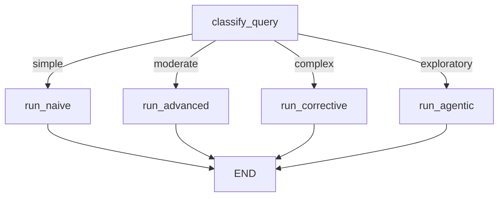

# Adaptive RAG

**Cost & performance optimization.** A meta-architecture that uses an LLM classifier to route user queries to the most appropriate RAG pipeline based on query complexity. 

Why use a heavy Agentic RAG pipeline (slow, expensive) for a simple factual question? Adaptive RAG ensures you only pay the latency and token cost for complex pipelines when the query actually requires them.

> **TL;DR:** Classify Query → Route to [Naive | Advanced | Corrective | Agentic] → Execute selected pipeline.

---

## How It Works

```
                                  ┌──▶ Naive RAG (Simple)
                                  │
┌─────────┐    ┌──────────────┐   ├──▶ Advanced RAG (Moderate)
│  Query  │───▶│  Classifier  │──▶┤
└─────────┘    └──────────────┘   ├──▶ Corrective RAG (Complex)
                                  │
                                  └──▶ Agentic RAG (Exploratory)
```

### Step-by-Step Flow

1. **Input Validation** — Query passes through guardrails
2. **Classification** — An LLM evaluates the query and categorizes it into one of four complexity levels:
   - `simple`: Direct factual questions, lookups, definitions
   - `moderate`: Questions requiring synthesis or minor contextual understanding
   - `complex`: Multi-hop reasoning, analytical questions
   - `exploratory`: Open-ended research questions
3. **Routing** — The system maps the assigned category to a specific RAG architecture (configurable in `adaptive.yaml`).
4. **Execution** — The selected architecture is instantiated and executed, inheriting the same session and history.
5. **Output Validation** — Response passes through output guardrails

### LangGraph State Machine



### When to Use

| ✅ Good For | ❌ Not Ideal For |
|---|---|
| Production systems with highly diverse query types | Systems where queries are overwhelmingly uniform in complexity |
| Optimizing API costs while maintaining high quality | When the classification step itself introduces unacceptable latency |
| Scalable consumer-facing applications | Small local models that struggle with accurate text classification |

---

## Configuration

File: `config/architectures/adaptive.yaml`

```yaml
# Default number of documents to retrieve
top_k: 5

# Routing rules: which architecture to use for each complexity level
routing:
  simple: "naive"         # Direct factual questions → fast path
  moderate: "advanced"    # Synthesis questions → rewrite + rerank
  complex: "corrective"   # Analytical questions → grade + retry
  exploratory: "agentic"  # Open-ended research → agent with tools
```

### Key Parameters

| Parameter | Default | Description |
|---|---|---|
| `routing` | See above | Maps the 4 classification outputs to target architectures. You can point multiple complexities to the same architecture if desired. |

---

## Testing

```bash
# 1. Start with Adaptive RAG in verbose mode
uv run main.py --arch adaptive --verbose

# 2. Test a simple query (Should route to Naive RAG)
You: What is the company name?

# 3. Test a moderate query (Should route to Advanced RAG)
You: How does the basic plan differ from the pro plan?

# 4. Test a complex query (Should route to Corrective or Agentic)
You: Based on the Q3 report, what are the biggest risks compared to last year?
```

**What to verify:**
- The LLM accurately classifies the query intent
- The system correctly instantiates and delegates to the target architecture
- The fallback logic works (defaults to `moderate` if classification fails)

---

## Limitations

- **Classification Latency** — Adaptive RAG adds an upfront LLM call to classify the query. For very fast systems, this initial overhead might negate the speed benefits of routing to Naive RAG.
- **Classifier Accuracy** — If the LLM misclassifies a complex query as "simple", the Naive RAG pipeline will likely fail to answer it correctly.

---

## Research Papers

| Paper | Year | Venue | Relevance |
|---|---|---|---|
| [Adaptive-RAG: Learning to Adapt Retrieval-Augmented Large Language Models through Question Complexity](https://arxiv.org/abs/2403.14403) | 2024 | arXiv | Introduces the concept of dynamically selecting retrieval strategies based on query complexity to balance efficiency and accuracy. |

## Implementation

Source: [`src/core/architectures/adaptive.py`](../../src/core/architectures/adaptive.py)

Key classes and methods:
- `AdaptiveRAG` — Main architecture class
- `_classify_query()` — LLM-based query classification
- `_route_by_complexity()` — Maps classification to target architecture
- `_run_naive()`, `_run_advanced()`, etc. — Sub-graph execution nodes
