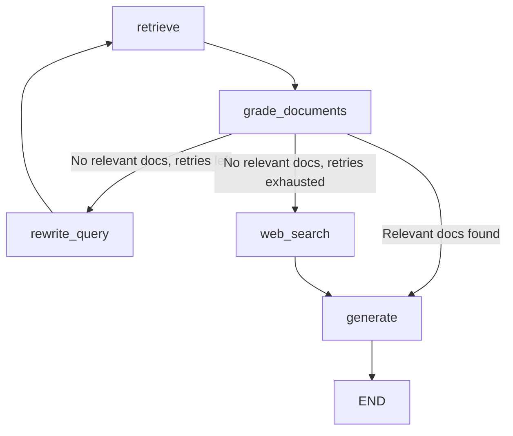

# Corrective RAG (CRAG)

**Retrieval quality gate.** Implements LLM-as-judge document grading to verify that retrieved documents are actually relevant before generating an answer. If retrieval fails, it self-corrects by rewriting the query or falling back to web search.

> **TL;DR:** Retrieve → Grade Docs → Relevant? → Generate. Not relevant? → Rewrite query and retry, or fall back to web search.

---

## How It Works

```
                              ┌──────────────┐
                         ┌───▶│   Generate   │───▶ Answer
                         │    └──────────────┘
                  Relevant│
┌─────────┐    ┌─────────┴──┐    Not Relevant     ┌──────────┐
│  Query  │───▶│  Retrieve  │───▶ Grade Docs ────▶│ Rewrite  │───┐
└─────────┘    └─────────▲──┘                     │  Query   │   │
                         │                        └──────────┘   │
                         └───────────────────────────────────────┘
                              (retry loop, max N times)
                                      │
                                      │ Max retries exceeded
                                      ▼
                              ┌──────────────┐
                              │  Web Search  │───▶ Generate ───▶ Answer
                              └──────────────┘
```

### Step-by-Step Flow

1. **Input Validation** - Query passes through guardrails
2. **Retrieval** - Vector store returns top-K documents
3. **Document Grading** - Each document is individually graded by the LLM:
   - The LLM acts as a relevance judge, answering "Is this document relevant to the question?" with a simple yes/no
   - Only documents graded as "relevant" pass through
4. **Decision Point** - Based on grading results:
   - **Relevant docs found** → Proceed to generation
   - **No relevant docs + retries remaining** → Rewrite the query and re-retrieve
   - **No relevant docs + retries exhausted** → Fall back to web search (if enabled)
5. **Generation** - LLM generates answer from the surviving context
6. **Output Validation** - Response passes through output guardrails
7. **Memory** - Interaction is saved to chat history

### LangGraph State Machine

This architecture uses [LangGraph](https://langchain-ai.github.io/langgraph/) to manage its state machine. The graph has 5 nodes:



### When to Use

| ✅ Good For | ❌ Not Ideal For |
|---|---|
| High-accuracy requirements (legal, medical, compliance) | Low-latency applications (grading adds LLM calls) |
| Documents where retrieval quality varies | Simple factual Q&A where basic retrieval works |
| Systems where "I don't know" is better than hallucination | Cost-sensitive setups (extra LLM calls for grading) |
| Mixed-quality document collections | Tiny document sets where every doc is likely relevant |
| When you need web search fallback for gaps in local docs | Offline environments without web access (if relying on fallback) |

---

## Configuration

File: `config/architectures/corrective.yaml`

```yaml
# Number of documents to retrieve per attempt
top_k: 5

# Maximum query rewrite attempts before falling back to web search
max_retries: 2

# Enable web search fallback when local docs aren't relevant
web_search: true
```

### Key Parameters

| Parameter | Default | Description |
|---|---|---|
| `top_k` | `5` | Number of documents to retrieve from vector store per attempt |
| `max_retries` | `2` | Maximum query rewrite attempts before falling back to web search |
| `web_search` | `true` | Enable/disable web search fallback. When disabled, generates with whatever context is available. |

### Global Settings That Affect Corrective RAG

| Setting (in `settings.yaml`) | Description |
|---|---|
| `web_search.provider` | `duckduckgo` (free) or `tavily` (API key for higher quality) |
| `web_search.max_results` | Number of web search results to fetch (default: 3) |

---

## Testing

```bash
# 1. Start with Corrective RAG
uv run main.py --arch corrective

# 2. Test with verbose mode to see document grading in action
uv run main.py --arch corrective --verbose

# 3. Ask a question clearly covered in your documents
You: What is the return policy?
# Verbose should show: docs graded as relevant → generate

# 4. Ask something partially related to your docs
You: What are the shipping costs to Antarctica?
# Verbose should show: docs graded as not relevant → rewrite → retry

# 5. Ask something not in your docs at all
You: What is the current stock price of Apple?
# Verbose should show: retries exhausted → web search → generate

# 6. Test with web search disabled
# Set web_search: false in config/architectures/corrective.yaml
# Then ask a question not in your docs
```

**What to verify:**
- Relevant documents are correctly identified and kept
- Irrelevant documents are filtered out
- Query is rewritten and re-retrieved when first attempt fails
- Web search fallback triggers after max retries
- Graceful handling when web search is disabled or unavailable
- Response quality is higher than Naive RAG for ambiguous queries

---

## Document Grading Internals

The grading prompt sends each document individually to the LLM:

```
System: You are a document relevance grader. Given a user question and a 
        document, determine if the document is relevant to answering the 
        question. Respond with ONLY 'yes' or 'no'.
```

## Research Papers

| Paper | Year | Venue | Relevance |
|---|---|---|---|
| [CRAG: Corrective Retrieval Augmented Generation](https://arxiv.org/abs/2401.15884) | 2024 | arXiv | The original CRAG paper. Introduces the concept of grading retrieved documents and using web search as a fallback for low-quality retrieval. |

## Implementation

Source: [`src/core/architectures/corrective.py`](../../src/core/architectures/corrective.py)

Key classes and methods:
- `CorrectiveRAG` - Main architecture class
- `_build_graph()` - Sets up the LangGraph workflow
- `_grade_documents()` - LLM-as-judge relevance grading
- `_decide_after_grading()` - Routing logic
- `_web_search()` - Fallback web search using `WebSearchTool`
