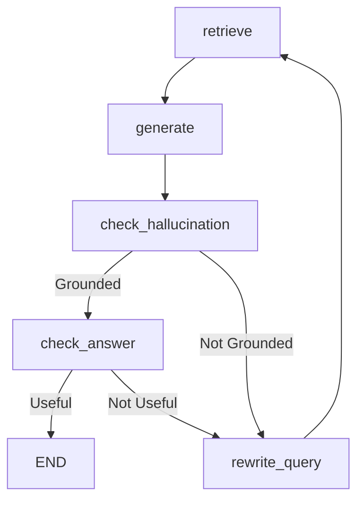

# Self-RAG

**Hallucination control.** A self-reflective architecture that critiques its own outputs. It generates an answer and then verifies two things: is the answer grounded in the retrieved documents, and does it actually answer the user's question?

> **TL;DR:** Retrieve → Generate → Grade Hallucination → Grade Usefulness → Return or Retry.

---

## How It Works

```
                                              ┌─────────────┐
                                      yes ───▶│ Check Useful│─── yes ──▶ Answer
                                     │        └─────────────┘
                                     │               │
┌─────────┐    ┌──────────┐    ┌─────┴───────┐       │ no
│  Query  │───▶│ Generate │───▶│  Grounded?  │       │
└─────────┘    └──────────┘    └─────┬───────┘       │
      ▲              ▲               │               │
      │              │            no │               │
      │              └───────────────┼───────────────┘
      │                              ▼
      │                      ┌───────────────┐
      └──────────────────────│ Rewrite Query │
         (retry loop)        └───────────────┘
```

### Step-by-Step Flow

1. **Input Validation** - Query passes through guardrails
2. **Retrieval** - Vector store returns top-K documents
3. **Initial Generation** - LLM generates a first-draft answer based *only* on the context
4. **Hallucination Check** - A second LLM call grades the generation:
   - "Is this answer grounded in / supported by the provided documents?"
   - If **No**: The answer is hallucinated. The query is rewritten to find better context, and the process restarts from step 2.
   - If **Yes**: Proceed to the next check.
5. **Usefulness Check** - A third LLM call grades the generation again:
   - "Does this answer actually resolve the user's question?"
   - If **No**: The answer is factually correct but unhelpful. The query is rewritten and the process restarts.
   - If **Yes**: The answer is both grounded and useful. Return it to the user.
6. **Output Validation & Memory** - Same as other architectures

### LangGraph State Machine



### When to Use

| ✅ Good For | ❌ Not Ideal For |
|---|---|
| Systems where hallucination is unacceptable | Latency-critical applications (3+ LLM calls per turn) |
| Critical domains (finance, healthcare, legal) | Cost-sensitive setups |
| Complex questions where the first draft is often wrong | Simple, unambiguous document collections |
| When accuracy is more important than speed | Systems using slow/small local LLMs (grading accuracy may suffer) |

---

## Configuration

File: `config/architectures/self_rag.yaml`

```yaml
# Number of documents to retrieve
top_k: 5

# Maximum reflection/retry iterations
max_iterations: 3
```

### Key Parameters

| Parameter | Default | Description |
|---|---|---|
| `top_k` | `5` | Number of documents to retrieve from vector store |
| `max_iterations` | `3` | Maximum loop cycles. If exceeded, returns the best-effort generation. |

---

## Testing

```bash
# 1. Start with Self-RAG
uv run main.py --arch self_rag

# 2. Test with verbose mode to see the self-reflection
uv run main.py --arch self_rag --verbose

# 3. Ask a tricky question that might cause hallucination
You: What did the CEO say about the new competitor in 2023?
# Verbose should show the hallucination and usefulness checks in action
```

**What to verify:**
- Hallucination checks accurately detect when the LLM makes things up
- Usefulness checks catch when the LLM says "The document says X" but it doesn't answer the question
- The retry loop successfully reformulates queries to find better context
- The system breaks out of the loop gracefully when `max_iterations` is reached

---

## CRAG vs Self-RAG

While similar, CRAG and Self-RAG intervene at different stages:
- **Corrective RAG (CRAG)** grades the *documents* before generation.
- **Self-RAG** grades the *generation* after it's produced.

If your retrieval is noisy, use CRAG. If your LLM is prone to hallucination even with good context, use Self-RAG.

---

## Research Papers

| Paper | Year | Venue | Relevance |
|---|---|---|---|
| [Self-RAG: Learning to Retrieve, Generate, and Critique through Self-Reflection](https://arxiv.org/abs/2310.11511) | 2023 | arXiv | Original Self-RAG paper. Introduces the concept of generating reflection tokens to critique the output on the fly. This implementation adapts the concept using LangGraph for explicit critique steps. |

## Implementation

Source: [`src/core/architectures/self_rag.py`](../../src/core/architectures/self_rag.py)

Key methods:
- `_check_hallucination()` - Groundedness grader
- `_check_answer()` - Usefulness grader
